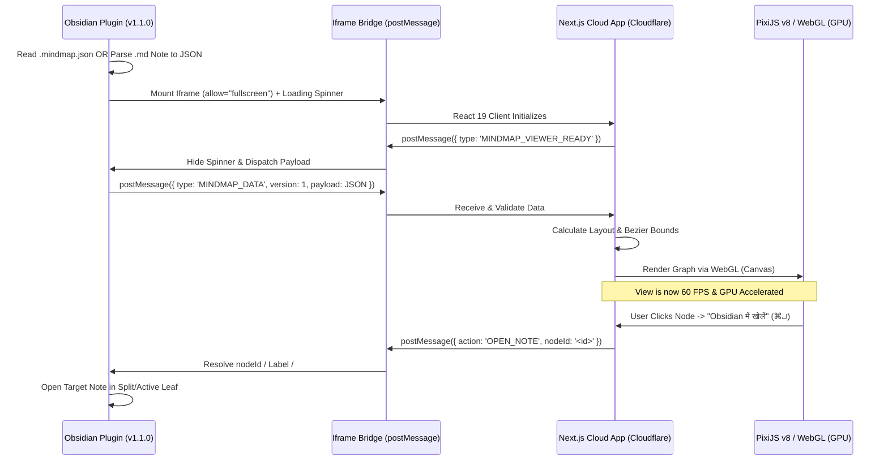

# Mind Map WebGL Migration Plan & Execution Log

This document outlines the strategic architectural update to transition the Mind Map viewer from a DOM-based rendering system to a high-performance WebGL solution using PixiJS, paired with the upgraded bi-directional **Obsidian MindMap Bridge (`v1.1.0`)**.

> **Important:** The primary requirement is that the view operates flawlessly **inside the Obsidian Extension** as an iframe, ensuring a seamless 60 FPS user experience and bi-directional vault navigation.

## 🎯 The "Why"
Obsidian is built on Electron. Injecting an iframe that renders 2,000+ HTML `
` elements using React/Next.js will bottleneck Obsidian’s main memory thread, causing noticeable lag and app degradation. 

By utilizing **PixiJS v8 (WebGL)**, the Next.js app leverages the user's GPU instead. This keeps Obsidian's memory footprint light, ensuring the mind map glides at a buttery 60 FPS.

## 🏗️ Architecture Flow

---

## ☁️ Phase 1: Cloud App Updates (Next.js) — [COMPLETED ✅]

The Cloudflare Next.js application (`https://mindmap.riyasaksena502.workers.dev`) has transitioned from an HTML renderer to a PixiJS v8 WebGL renderer:

1. **Deprecate DOM Elements — [DONE ✅]**: Deleted `MindMapNodeCard.tsx` and legacy DOM canvas; 100% GPU rendering via `MindMapWebGLCanvas.tsx`.
2. **PixiJS v8 & Viewport Culling — [DONE ✅]**: Integrated `pixi.js` and `pixi-viewport` with off-screen culling and spatial hit-testing.
3. **Google Stitch Modern Minimal UI — [DONE ✅]**: Zero-dot studio surface (`.canvas-stage`), Pure Porcelain cards with 2-layer shadows and `4px` branch accent bars, right-docked Porcelain Inspector on desktop, and Bottom Sheet on mobile.
4. **3.5× Retina Text & Mobile 2-Column Progressive UX — [DONE ✅]**: Super-sampled text (`TEXT_RESOLUTION = 3.5`), mobile 2-column Tree default with `+count` pills, and smart camera auto-focus (`frameNodeSubset`).
5. **Bi-directional Bridge (`OPEN_NOTE`) — [DONE ✅]**: Wired `MindMapNodeDetailPanel.tsx` with **"Obsidian में खोलें"** button and `<kbd>⌘↵</kbd>` shortcut dispatching `window.parent.postMessage({ action: 'OPEN_NOTE', nodeId: node.id }, '*')`.

---

## 🔌 Phase 2: Viewer Extension Updates (Obsidian Plugin `v1.1.0`) — [COMPLETED ✅]

The Obsidian plugin acts as the local Controller, Markdown-to-MindMap Compiler, and Bi-Directional Vault Navigator.

### 1. Iframe Container, Permissions & Loading Overlay — [DONE ✅]
- **Implementation:** [`src/MindMapFileView.ts`](src/MindMapFileView.ts) & [`styles.css`](styles.css)
- **Outcome:** Added `allow="fullscreen; clipboard-read; clipboard-write"` so the Stitch toolbar's Fullscreen toggle works inside Obsidian, plus a native `.mindmap-bridge-loading` spinner overlay until `MINDMAP_VIEWER_READY` is received.

### 2. Markdown to JSON Engine — [DONE ✅]
- **Implementation:** [`src/markdownParser.ts`](src/markdownParser.ts)
- **Outcome:** Parses Obsidian `.md` notes (YAML frontmatter, `#`–`######` headings, bullet points into `keyFacts`, `[[WikiLinks]]` into `node.id` and `crossLinks`, `#tags`, and automatic Hindi/English language detection) into the validated `MindMapData` schema. Supports both live `.md` visualization and 1-click `.mindmap.json` export.

### 3. Local-to-Cloud Data Transfer & Live Sync — [DONE ✅]
- **Implementation:** [`src/MindMapFileView.ts`](src/MindMapFileView.ts)
- **Outcome:** Responds to `MINDMAP_VIEWER_READY` and debounced vault `modify` events by dispatching `{ type: 'MINDMAP_DATA', version: 1, payload: jsonString }` for both `.mindmap.json` and `.md` files.

### 4. Intercept & Navigate (`OPEN_NOTE`) — [DONE ✅]
- **Implementation:** `handleOpenNoteRequest()` in [`src/MindMapFileView.ts`](src/MindMapFileView.ts)
- **Outcome:** Intercepts `{ action: "OPEN_NOTE", nodeId }` from the Cloud App and resolves the target note via 5-tier resolution (direct linkpath + `#heading` subpath, node `label` lookup, case-insensitive vault `.md` match, current `.md` section jump, and optional auto-creation) opening in a beside split/tab (`openNoteInNewLeaf`).
